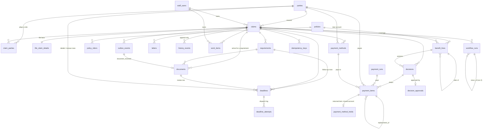

# Schema notes

Migrations are in `src/Claims.Api/Migrations/Scripts` (`V1` to `V5`, the Flyway files unchanged, `V6`, added for the simple scenario, `V7`, added for the complex "things bounce back" scenario, and `V8`, a letter that became moot can be `skipped`; run by DbUp; earlier scripts are untouched by later ones). PostgreSQL 16 or later; verified on 18.
Development staff rows are a repeatable script in `Migrations/Scripts/Dev`, run only when `Claims:Db:DevSeed` is true (the Development environment).

## ER sketch

## Non-obvious choices

**Deadlines are rows, and the dispatcher's index is partial.**
`deadlines_dispatch_idx ON (due_at, id) WHERE state = 'open'` contains only rows still waiting. Closed rows leave the index the
moment they close, so the every-minute poll stays a short range scan however many years of rows accumulate. The poll is
`SELECT ... WHERE state='open' AND due_at <= now() ... ORDER BY due_at, id LIMIT n FOR UPDATE SKIP LOCKED`: two dispatchers, or a
Schedule tick overlapping a manual run, each skip the rows the other holds and never fire the same row twice. A test proves it
with a second connection holding row locks (and hangs if `SKIP LOCKED` is removed).

**States: `open`, `dispatched`, `done`, `skipped`.** `dispatched` means the dispatcher started `deadline-<id>`; only the workflow
closes it. `CHECK` constraints tie the states to their bookkeeping: a finished row has `closed_at`, `result` and `closed_by`;
a dispatched row has `attempt > 0` and `dispatched_at`; a moved `due_at` needs an `extension_reason`, and `original_due_at` never changes.
A row that stays `dispatched` after its workflow failed is what the nightly check looks for (`deadlines_stuck_idx`).

**"Write the next row" is safe to repeat.** Partial unique indexes allow one live follow-up per requirement and one live status letter
per claim. A workflow retried after it already wrote the next row hits the index instead of chasing twice. Closing is compare-and-set
(`... WHERE state IN ('open','dispatched')`), so whoever closes first wins and the other sees zero rows.

**Failed starts back off without moving the legal date.** `attempt`, `retry_after`, `last_outcome` and `last_error` record what the
dispatcher did; `due_at` stays the deadline. `deadline_attempts` is an append-only log of every attempt.

**Enums are `text` plus a named `CHECK`, not `CREATE TYPE ... AS ENUM`.** A check can be dropped and re-added in one migration; an enum
value can never be removed, and adding one has transaction limits. The C# enums mirror the strings exactly (`DeadlineKind.RequirementFollowUp`
is `requirement_follow_up`).

**Money is `numeric(15,2)` with a `currency` column.** `payment_items.amount` is a generated column,
`principal_amount + interest_amount`, so the total cannot disagree with its parts. The API sends money as decimal strings.

**Optimistic concurrency by trigger.** Mutable tables have `version bigint` and a `BEFORE UPDATE` trigger (`touch_row`) that sets
`version = old + 1` and `updated_at = now()`. Workflows, batch jobs and a hand-run fix all bump it, so an API client's `If-Match` is
never silently stale. The API's `ETag` is that version.

**Append-only means the database says no.** `history_events`, `deadline_attempts` and `decisions` reject `UPDATE` and `DELETE`
(`history_events` also `TRUNCATE`) with a trigger. A decision correction is a new `version` that `supersedes_id` the old one
(`version = 1` exactly when there is no predecessor; `UNIQUE (benefit_line_id, version)`). Give the application role no `UPDATE`,
`DELETE` or `TRUNCATE` on these tables as well; triggers stop mistakes, grants stop a compromised service.

**Paid payment items cannot be edited.** `guard_payment_item` rejects a change to money, payee, method or date once an item is
`in_run`, `paid` or `returned`, and a paid item can only become `returned`. A correction is an `adjustment` item pointing at
`adjusts_item_id`. `UNIQUE (decision_id, benefit_line_id, payee_party_id, kind)` means "create the items for this decision" cannot pay twice.

**The outbox and every "do it once" table carry a key.** `outbox_events` is written in the same transaction as the change and stamped
`published_at` by the relay (partial index on unpublished rows). `letters.dedupe_key` and `work_items.dedupe_key` are unique, so a retried
activity inserts the same key and finds the row already there. `idempotency_keys (scope, key)` holds the request hash and the claim it
created, written in the same transaction as the claim.

**Parties are claim-agnostic; roles live on the claim.** `parties` is one row per person or organisation, so a later party master can merge
duplicates. `claim_parties (claim_id, party_id, role)` says who is insured, caller, beneficiary (with share and whether they are a payee),
agent of record or funeral home. Intake currently creates new party rows every time; matching against existing people is not built.

**Policies are snapshots.** Policy administration is the system of record. `policies` holds the claims-relevant fields as of `as_of`,
upserted by policy number at intake. Riders are `policy_riders`, and each rider on a claim becomes its own `benefit_lines` row (with a
parent) so it can be decided and paid separately. `product_config_version` on the line pins the contract terms.

**Life facts sit beside the claim, not in it.** `life_claim_details` (one row per life claim) keeps `claims` generic; disability and
annuity get their own detail tables. `claims.track` and `route_rule` stay null until the intake workflow routes the claim, and a check
constraint forbids leaving `received` without them.

**Workflow runs record what happened, in Postgres.** `workflow_runs (workflow_id, run_id)` is unique; `steps` is a `jsonb` array of
`{label, detail, system, state}`. The run is finished in the same transaction as the state change it describes, so the record and the
result cannot disagree.

## V6: what the simple scenario added

**A decision above authority is recorded, and its approval is a separate row.** `decisions` stays append-only. `requires_approval` says the amount was above the recorder's authority, `group_id` ties the decisions of
one act (the base line and its riders) together, `amount` is proceeds plus interest as computed when it was recorded. `decision_approvals (decision_id PK, approved_by, approved_at, note)` is append-only too. A decision
is `awaiting_approval` exactly when `requires_approval` is true and it has no approval row; the view derives that and the "approved by" note, so nothing is ever updated. (`decisions.approved_by` and
`approved_at`, from V4, stay unused: a decision cannot be updated to fill them.)

**The claim has `paying`.** `approved` (items cleared, waiting for a run), `paying` (an item has gone to the bank, not all are paid), `closed`. A claim closes when every payment item is `paid` (or `cancelled`), at least one is
paid, and no benefit line is still `approved`, `ready_to_decide`, `gathering_evidence` or `cause_pending`.

**Payment items get the bank's answer and a replacement link.** `payment_reference` (paid), `return_code` and `return_reason` (returned), `replacement_of_id` (a replacement points at the item it replaces; `payment_items_once` is
now a partial unique index that applies to originals only, so a replacement for the same decision, line and payee is allowed). `guard_payment_item` is stricter: once an item is `in_run`, `paid` or `returned` its money, payee, method,
date, decision, kind and links are frozen; once `paid` or `returned` its run, `paid_at` and reference are frozen; a paid item can only become `returned`; a `returned` item is final (V4 allowed anything from `returned`).

**Payment runs** gain `idempotency_key` (unique when present: a repeat of a manual trigger returns the run; scheduled runs are unique per date by the V4 index), `paid_count`, `returned_count` and `error`.
`idempotency_keys.resource_id` records what a repeated `POST /decisions` created. A deadline row can be closed by `payment` (the `payment_due` row).

**Locking order** (why two runs cannot leave a paid claim open): a transaction that touches several claims locks the claim rows first, in id order; the run's claim statement locks items with `SKIP LOCKED`; a decision locks
its claim, then inserts new items. See `PaymentRepository.LockClaimsAsync`.

## V7: what the complex scenario ("things bounce back") added

Nothing in V7 rewrites a row: it widens four checks, adds columns and three tables. It is safe on a database that has V1 to V6 data.

**Documents are rows with an outbox event, and the requirement is decided later.** `documents` (`kind`, `source`, `attributes` jsonb, `status`: `received`, `accepted`, `not_enough`, `under_review`, `rejected`, `status_note`, who reviewed it and why)
is written with its `document_received` outbox event, its history line and its idempotency key in ONE transaction; the requirement is not touched then. The short workflow decides (IRS check, the rules, a hand-off to a person) and its own
transaction moves the document and the requirement together, through the same accept path a person's click uses. `requirements.state_note` says why a requirement is `not_enough` ("TIN mismatch") or `received` ("Under review: photocopy"). The taxpayer
number is kept in `attributes` only for the check; the API shows its last four digits.

**A claim reopens: `claims.status` gains `reopened`.** Only the payment-returned workflow moves a claim from `closed` to `reopened` (and clears `closed_at`, which `claims_closed_ck` ties to the closed status), and only while a returned payment still has no
PAID replacement. The payment run closes it again through the same statement that closed it the first time (`reopened` is a state it may close from), so a claim can close any number of times; the history has one "Claim closed" line per close.

**A returned payment and its replacement.** A paid item can become `returned` (V6 made it final and frozen); the replacement is a NEW row, `replacement_of_id` pointing at it, the same principal and interest. `payment_items_one_replacement` (a unique partial index)
makes "create the replacement" safe to repeat: one per returned item. A returned item that HAS a replacement is settled for the purposes of closing the claim and of marking a line paid; one without a replacement still keeps the claim open.
`payment_items.payment_method_id` says which account an item pays to: NULL is the account on file at intake, a value is a new account the payee gave (`payment_methods`: only the last 4 digits of the routing and account numbers are stored, and a status:
`pending_verification`, `verified`, `rejected`). `payment_method_holds` is one row per returned item (`source_item_id` is unique, so the returns batch is safe to repeat): while it exists no cleared item of that payee on that claim that pays to the
account on file is picked up by a payment run (the run's claim statement checks it, inside the same `FOR UPDATE SKIP LOCKED` statement). A new account does not lift the hold (the closed account stays closed); the hold records which method replaced it.

**Deadline kinds without a workflow.** `document_review_by` and `bank_details_by` join the check constraint, and `deadlines` gains `document_id` and `party_id` (what the row is about). Neither kind has a workflow on purpose: they are rows a person (or the
payee's own action) closes, and the nightly overdue check raises them to a person when they are late. The overdue check writes a work item with the dedupe key `overdue:<row id>` (once per row), and a trigger (`deadlines_overdue_done`) marks that work item
done when the row closes, whoever closes it. Follow-up rows for a corrected W-9 and for a certified copy are ordinary `requirement_follow_up` rows: `deadlines_one_live_follow_up` allows one live row per requirement, so the row that waited is closed
before the next is written (in the same transaction).

**Outbox event types** `document_rejected`, `payment_returned` and `payment_method_updated` join `document_received`; each starts an event workflow `event-<outbox event id>`.

**Workflow runs carry their story.** `run_no` and `rerun_of_id` (an ops re-run of a failed run is run 2 of the same workflow id, linked to run 1), `note` ("what Temporal did", in plain words, appended to while the run goes on), and `elapsed_ms` (real time from
Begin to Finish: `opened_real_at` is `now()` on purpose, the business clock may be virtual). Steps inside `steps` gain `attempts` and `note`, and a `failed` state; rows written before that still read (defaults).

## Not in the schema yet

Extracted document fields and object storage for the files themselves (a document is a row with attributes), notes, contestable review, distributions and elections, product configuration tables and the state
rules table, party matching, a bank returns / reconciliation table (the stub bank's returns queue lives in the stub, in memory; a real bank's returns file is read through `IBankGateway.ReadReturnsAsync`), portal accounts.

## V8: a skipped letter

Nothing in V8 rewrites a row: it widens `letters_status_ck` to `draft, queued, sent, failed, skipped` and adds the nullable `letters.status_reason`. A letter is `skipped` when it was queued but the situation changed before it went out (a re-run of the document workflow accepted the W-9 that run 1 had asked to be corrected);
the one guarded UPDATE that does it only touches a letter that has not been sent, so it is safe to repeat, and `dedupe_key` still keeps the row from being written twice. `letters_sent_ck` is unchanged: only `sent` has a `sent_at`. (The Java backend's schema stops at V7; V8 exists only in this port.)
