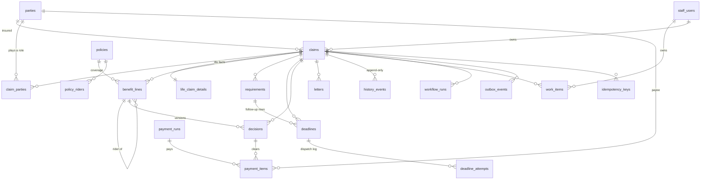

# Schema notes

Migrations are in `src/main/resources/db/migration` (Flyway, `V1` to `V5`). PostgreSQL 16 or later; verified on 18.
Development staff rows are a repeatable migration in `db/dev`, loaded only by the `dev` profile.

## ER sketch

## Non-obvious choices

**Deadlines are rows, and the dispatcher's index is partial.**
`deadlines_dispatch_idx ON (due_at, id) WHERE state = 'open'` contains only rows still waiting. Closed rows leave the index the
moment they close, so the every-minute poll stays a short range scan however many years of rows accumulate. The poll is
`SELECT ... WHERE state='open' AND due_at <= now() ... ORDER BY due_at, id LIMIT n FOR UPDATE SKIP LOCKED`: two dispatchers, or a
Schedule tick overlapping a manual run, each skip the rows the other holds and never fire the same row twice. A test proves it
with a second connection holding row locks (and hangs if `SKIP LOCKED` is removed).

**States: `open`, `dispatched`, `done`, `skipped`.** `dispatched` means the dispatcher started `deadline-<id>`; only the workflow
closes it. `CHECK` constraints tie the states to their bookkeeping: a finished row has `closed_at`, `result` and `closed_by`;
a dispatched row has `attempt > 0` and `dispatched_at`; a moved `due_at` needs an `extension_reason`, and `original_due_at` never changes.
A row that stays `dispatched` after its workflow failed is what the nightly check looks for (`deadlines_stuck_idx`).

**"Write the next row" is safe to repeat.** Partial unique indexes allow one live follow-up per requirement and one live status letter
per claim. A workflow retried after it already wrote the next row hits the index instead of chasing twice. Closing is compare-and-set
(`... WHERE state IN ('open','dispatched')`), so whoever closes first wins and the other sees zero rows.

**Failed starts back off without moving the legal date.** `attempt`, `retry_after`, `last_outcome` and `last_error` record what the
dispatcher did; `due_at` stays the deadline. `deadline_attempts` is an append-only log of every attempt.

**Enums are `text` plus a named `CHECK`, not `CREATE TYPE ... AS ENUM`.** A check can be dropped and re-added in one migration; an enum
value can never be removed, and adding one has transaction limits. Java enums mirror the strings exactly (`DeadlineKind.REQUIREMENT_FOLLOW_UP`
is `requirement_follow_up`).

**Money is `numeric(15,2)` with a `currency` column.** `payment_items.amount` is a generated column,
`principal_amount + interest_amount`, so the total cannot disagree with its parts. The API sends money as decimal strings.

**Optimistic concurrency by trigger.** Mutable tables have `version bigint` and a `BEFORE UPDATE` trigger (`touch_row`) that sets
`version = old + 1` and `updated_at = now()`. Workflows, batch jobs and a hand-run fix all bump it, so an API client's `If-Match` is
never silently stale. The API's `ETag` is that version.

**Append-only means the database says no.** `history_events`, `deadline_attempts` and `decisions` reject `UPDATE` and `DELETE`
(`history_events` also `TRUNCATE`) with a trigger. A decision correction is a new `version` that `supersedes_id` the old one
(`version = 1` exactly when there is no predecessor; `UNIQUE (benefit_line_id, version)`). Give the application role no `UPDATE`,
`DELETE` or `TRUNCATE` on these tables as well; triggers stop mistakes, grants stop a compromised service.

**Paid payment items cannot be edited.** `guard_payment_item` rejects a change to money, payee, method or date once an item is
`in_run`, `paid` or `returned`, and a paid item can only become `returned`. A correction is an `adjustment` item pointing at
`adjusts_item_id`. `UNIQUE (decision_id, benefit_line_id, payee_party_id, kind)` means "create the items for this decision" cannot pay twice.

**The outbox and every "do it once" table carry a key.** `outbox_events` is written in the same transaction as the change and stamped
`published_at` by the relay (partial index on unpublished rows). `letters.dedupe_key` and `work_items.dedupe_key` are unique, so a retried
activity inserts the same key and finds the row already there. `idempotency_keys (scope, key)` holds the request hash and the claim it
created, written in the same transaction as the claim.

**Parties are claim-agnostic; roles live on the claim.** `parties` is one row per person or organisation, so a later party master can merge
duplicates. `claim_parties (claim_id, party_id, role)` says who is insured, caller, beneficiary (with share and whether they are a payee),
agent of record or funeral home. Intake currently creates new party rows every time; matching against existing people is not built.

**Policies are snapshots.** Policy administration is the system of record. `policies` holds the claims-relevant fields as of `as_of`,
upserted by policy number at intake. Riders are `policy_riders`, and each rider on a claim becomes its own `benefit_lines` row (with a
parent) so it can be decided and paid separately. `product_config_version` on the line pins the contract terms.

**Life facts sit beside the claim, not in it.** `life_claim_details` (one row per life claim) keeps `claims` generic; disability and
annuity get their own detail tables. `claims.track` and `route_rule` stay null until the intake workflow routes the claim, and a check
constraint forbids leaving `received` without them.

**Workflow runs record what happened, in Postgres.** `workflow_runs (workflow_id, run_id)` is unique; `steps` is a `jsonb` array of
`{label, detail, system, state}`. The run is finished in the same transaction as the state change it describes, so the record and the
result cannot disagree.

## Not in the schema yet

Documents and extracted fields, notes, contestable review, distributions and elections, product configuration tables and the state
rules table, party matching, a `payment_run` reconciliation table, portal accounts, and the `event_type` values for documents,
decisions and payments beyond the four the outbox check already allows.
